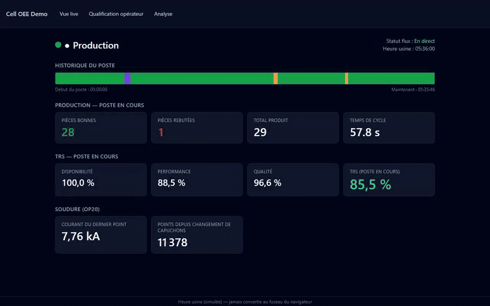
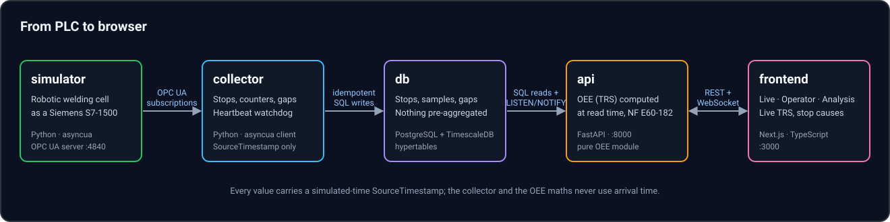

# Cell OEE Demo — from PLC to browser



Real-time OEE (TRS) for a simulated robotic welding cell: OPC UA in, live web app out.

[English](#english) · [Français](#français)

---

# English

## Quick start

```bash
docker compose up
```

Then open:

- **Live cell view** — <http://localhost:3000/live>
- **Operator stop qualification** (tablet-first) — <http://localhost:3000/operator>
- **Analysis** (Pareto, OEE per shift and day, electrode wear curve) — <http://localhost:3000/analysis>

You need Docker with Compose v2. The first run builds the images and pre-loads a few simulated days of history, so the screens are not empty. Allow up to two minutes, depending on how many base images have to be pulled. The UI is in French.

- The cell is simulated at 10× speed. Set `ACCELERATION` (1 to 60) in `.env` to change it. Breakdowns are random: raise it to see one sooner.
- `docker compose down -v` stops everything and erases the data, for a fresh start.
- Port 4840 is published so you can point an OPC UA client such as UaExpert at the simulator.

## Why this project

Too often, OEE is computed after the fact: an Excel sheet fed from paper notes, a week late, with half the stops filed under "other". This project shows the alternative. The OEE of the current shift is computed live from the controller's own signals, and the operator qualifies each stop on a tablet while the reason is still fresh.

OEE follows the French standard NF E60-182, defined in time, so Availability × Performance × Quality always reconciles exactly with the total.

**This is a demonstration project, not a commercial product.** The cell is simulated, there is no authentication, and it is meant to show how the pieces fit together, not to be deployed as is.

## Architecture



| Service     | Role |
|-------------|------|
| `simulator` | Robotic body-in-white cell (OP10 pre-weld assembly, OP20 robotic spot welding, OP30 post-weld assembly and check) exposed as an OPC UA server, with electrode wear, breakdowns, starved/blocked periods and planned breaks. |
| `collector` | Subscribes to the OPC UA tags, detects state changes and stops, watches the heartbeat, and writes everything idempotently, by source timestamp. |
| `db`        | PostgreSQL + TimescaleDB. Nothing is pre-aggregated. |
| `api`       | FastAPI. Computes OEE at read time; REST plus a WebSocket for the live view. |
| `frontend`  | Next.js: Live, Operator and Analysis screens. |

A one-shot `seed` step runs before the others, so the first start already has history and the live simulation continues from where the history ends.

## OEE in one paragraph

Every quantity is a duration, and a part is worth its theoretical cycle time. Availability = operating time ÷ required time; Performance = net time ÷ operating time; Quality = useful time ÷ net time; **OEE = A × P × Q = useful time ÷ required time**. Planned stops are removed from the required time, and communication gaps are excluded. Stops shorter than 120 s are micro-stops: they count as performance loss and are not shown for qualification. An undefined ratio is `null`, never 0. The full definitions and rules are in [CLAUDE.md](CLAUDE.md).

## From simulation to a real PLC

The address space mirrors a Siemens S7-1500 data block published through the CPU's OPC UA server, so the mapping is direct.

| Demo tag                        | OPC UA type | S7-1500 data type |
|---------------------------------|-------------|-------------------|
| `Cell/State`, `Mode`, `FaultCode`, `StopOrigin` | Int16   | `Int`  |
| `Cell/GoodCount`, `ScrapCount`  | UInt32      | `UDInt` (cumulative, never reset by the program) |
| `Cell/LastCycleTime`, `TheoreticalCycleTime` | Float | `Real` |
| `Cell/Heartbeat`                | UInt32      | `UDInt` (incremented every second by the program) |
| `OP10/OP20/OP30 State, FaultCode` | Int16     | `Int`  |
| `OP20/Weld/LastPointCurrent`    | Float       | `Real` |
| `OP20/Weld/PointsSinceCapChange`| UInt32      | `UDInt` |
| `OP20/Weld/LastPointOK`         | Boolean     | `Bool` |

What changes on a real controller:

- **Enable the server and publish the block.** In TIA Portal, activate the CPU's OPC UA server (it needs a runtime licence) and make the data block members accessible through OPC UA. Check your firmware's documentation for the exact steps.
- **Node identifiers.** Here a tag is a string node such as `Cell.State` under the namespace `urn:cell-oee-demo:plc`. A CPU exposes data block variables under its own namespace, typically as `ns=3;s="DB_Cell"."State"`. The mapping from tag to node ID lives in one place, `backend/app/collector/opcua_source.py`, and would be adapted there.
- **Write `State` and `StopOrigin` together.** The collector reads the origin of a stop from `Cell.StopOrigin` and never deduces it, so the PLC program must set both in the same scan.
- **Timestamps.** Everything is processed by the value's `SourceTimestamp`, never by arrival time. On a real CPU, keep its clock synchronised (NTP), and use `ACCELERATION=1`.
- **Counters and heartbeat.** Counters are cumulative and a decrease is treated as a PLC restart, never as negative production. A frozen heartbeat marks communication lost and records a gap that is excluded from the OEE.

### Security: disabled here, required in production

The demo simulator accepts anonymous, **unencrypted** OPC UA connections (`NoSecurity`) and publishes its port, which is acceptable for a simulated cell on your own machine and nowhere else. On a real controller:

- Use a security policy with **Sign & Encrypt** (for example `Basic256Sha256`), and exchange and trust certificates on both sides.
- Do not allow anonymous access: give the collector a dedicated **read-only** user or certificate.
- Keep the PLC on the OT network. Only the collector should reach the OPC UA port, through a firewall, and the port must not be published to other machines as the demo's `docker-compose.yml` does.

The collector does not configure OPC UA security yet: adding it is a prerequisite for any real deployment. The API and the frontend also have no authentication, which is out of scope for this demo.

## Tech stack

Python 3.12 (`asyncua`, FastAPI, SQLAlchemy, Alembic) · PostgreSQL + TimescaleDB · Next.js (App Router, TypeScript strict), Recharts · Docker Compose · pytest, Vitest, Playwright.

## Testing

```bash
cd simulator && pip install -e ".[dev]" && pytest          # simulation model
cd backend   && pip install -e ".[dev]" && pytest          # OEE core, collector, API (needs Docker)
cd frontend  && npm ci && npm run check                    # types, lint, unit tests, build
npm ci && npx playwright install chromium && npm run test:e2e   # from the repo root: full docker compose stack
```

The end-to-end run brings the whole stack up from scratch (the clean-machine test), loads the three screens, and checks that no console error occurs.

## License

[MIT](LICENSE).

---

# Français

## Démarrage rapide

```bash
docker compose up
```

Puis ouvrez :

- **Vue live de la cellule** — <http://localhost:3000/live>
- **Qualification des arrêts par l'opérateur** (pensée pour tablette) — <http://localhost:3000/operator>
- **Analyse** (Pareto, TRS par poste et par jour, courbe d'usure des électrodes) — <http://localhost:3000/analysis>

Il vous faut Docker avec Compose v2. Le premier démarrage construit les images et précharge quelques jours simulés d'historique, pour que les écrans ne soient pas vides. Comptez jusqu'à deux minutes, selon le nombre d'images de base à télécharger.

- La cellule est simulée à la vitesse ×10. Modifiez `ACCELERATION` (de 1 à 60) dans `.env` pour changer cela. Les pannes sont aléatoires : augmentez-la pour en voir une plus vite.
- `docker compose down -v` arrête tout et efface les données, pour repartir de zéro.
- Le port 4840 est publié pour que vous puissiez connecter un client OPC UA comme UaExpert au simulateur.

## Pourquoi ce projet

Trop souvent, le TRS est calculé après coup : un tableau Excel alimenté par des notes papier, une semaine plus tard, dont la moitié des arrêts est classée « autre ». Ce projet montre l'alternative. Le TRS du poste en cours est calculé en direct à partir des signaux de l'automate, et l'opérateur qualifie chaque arrêt sur une tablette pendant que la cause est encore fraîche.

Le TRS suit la norme française NF E60-182, définie en temps, si bien que Disponibilité × Performance × Qualité retombe toujours exactement sur le total.

**Ceci est un projet de démonstration, pas un produit commercial.** La cellule est simulée, il n'y a pas d'authentification, et le but est de montrer comment les briques s'assemblent, pas d'être déployé tel quel.

## Architecture


| Service     | Rôle |
|-------------|------|
| `simulator` | Cellule robotisée de caisse en blanc (OP10 assemblage avant soudure, OP20 soudage par points robotisé, OP30 assemblage et contrôle après soudure) exposée comme serveur OPC UA, avec usure des électrodes, pannes, manques de pièces, engorgements et pauses planifiées. |
| `collector` | Souscrit aux variables OPC UA, détecte les changements d'état et les arrêts, surveille le heartbeat et écrit tout de façon idempotente, par horodatage source. |
| `db`        | PostgreSQL + TimescaleDB. Rien n'est pré-agrégé. |
| `api`       | FastAPI. Calcule le TRS à la lecture ; REST et WebSocket pour la vue live. |
| `frontend`  | Next.js : écrans Live, Opérateur et Analyse. |

Une étape `seed` à usage unique s'exécute avant les autres : le premier démarrage a donc déjà de l'historique, et la simulation en direct continue là où il s'arrête.

## Le TRS en un paragraphe

Chaque grandeur est une durée, et une pièce vaut son temps de cycle théorique. Disponibilité = temps de fonctionnement ÷ temps requis ; Performance = temps net ÷ temps de fonctionnement ; Qualité = temps utile ÷ temps net ; **TRS = D × P × Q = temps utile ÷ temps requis**. Les arrêts planifiés sont retirés du temps requis et les trous de communication sont exclus. Les arrêts de moins de 120 s sont des micro-arrêts : ils comptent comme perte de performance et ne sont pas proposés à la qualification. Un ratio indéfini vaut `null`, jamais 0. Les définitions et règles complètes sont dans [CLAUDE.md](CLAUDE.md).

## Du simulateur à un vrai automate

L'espace d'adressage reproduit un bloc de données Siemens S7-1500 publié par le serveur OPC UA de la CPU : la correspondance est directe.

| Variable de la démo             | Type OPC UA | Type de donnée S7-1500 |
|---------------------------------|-------------|------------------------|
| `Cell/State`, `Mode`, `FaultCode`, `StopOrigin` | Int16   | `Int`  |
| `Cell/GoodCount`, `ScrapCount`  | UInt32      | `UDInt` (cumulatifs, jamais remis à zéro par le programme) |
| `Cell/LastCycleTime`, `TheoreticalCycleTime` | Float | `Real` |
| `Cell/Heartbeat`                | UInt32      | `UDInt` (incrémenté chaque seconde par le programme) |
| `OP10/OP20/OP30 State, FaultCode` | Int16     | `Int`  |
| `OP20/Weld/LastPointCurrent`    | Float       | `Real` |
| `OP20/Weld/PointsSinceCapChange`| UInt32      | `UDInt` |
| `OP20/Weld/LastPointOK`         | Boolean     | `Bool` |

Ce qui change sur un vrai automate :

- **Activer le serveur et publier le bloc.** Dans TIA Portal, activez le serveur OPC UA de la CPU (il demande une licence runtime) et rendez les membres du bloc de données accessibles par OPC UA. Consultez la documentation de votre firmware pour les étapes exactes.
- **Identifiants de nœuds.** Ici, une variable est un nœud texte comme `Cell.State` dans l'espace de noms `urn:cell-oee-demo:plc`. Une CPU expose les variables d'un bloc de données dans son propre espace de noms, typiquement sous la forme `ns=3;s="DB_Cell"."State"`. La correspondance variable → identifiant de nœud est à un seul endroit, `backend/app/collector/opcua_source.py`, et s'adapterait là.
- **Écrire `State` et `StopOrigin` ensemble.** Le collecteur lit l'origine d'un arrêt dans `Cell.StopOrigin` et ne la déduit jamais : le programme automate doit donc positionner les deux dans le même cycle.
- **Horodatages.** Tout est traité par le `SourceTimestamp` de la valeur, jamais par l'heure d'arrivée. Sur une vraie CPU, gardez son horloge synchronisée (NTP) et utilisez `ACCELERATION=1`.
- **Compteurs et heartbeat.** Les compteurs sont cumulatifs et une diminution est traitée comme un redémarrage de l'automate, jamais comme une production négative. Un heartbeat figé marque la communication perdue et enregistre un trou exclu du TRS.

### Sécurité : désactivée ici, indispensable en production

Le simulateur de la démo accepte des connexions OPC UA anonymes et **non chiffrées** (`NoSecurity`) et publie son port, ce qui est acceptable pour une cellule simulée sur votre propre machine, et nulle part ailleurs. Sur un vrai automate :

- Utilisez une politique de sécurité **Sign & Encrypt** (par exemple `Basic256Sha256`), avec échange et approbation des certificats des deux côtés.
- Interdisez l'accès anonyme : donnez au collecteur un utilisateur ou un certificat dédié, en **lecture seule**.
- Gardez l'automate sur le réseau OT. Seul le collecteur doit atteindre le port OPC UA, à travers un pare-feu, et ce port ne doit pas être publié vers d'autres machines comme le fait le `docker-compose.yml` de la démo.

Le collecteur ne configure pas encore la sécurité OPC UA : l'ajouter est un préalable à tout déploiement réel. L'API et le frontend n'ont pas non plus d'authentification, ce qui est hors périmètre de cette démo.

## Pile technique

Python 3.12 (`asyncua`, FastAPI, SQLAlchemy, Alembic) · PostgreSQL + TimescaleDB · Next.js (App Router, TypeScript strict), Recharts · Docker Compose · pytest, Vitest, Playwright.

## Tests

```bash
cd simulator && pip install -e ".[dev]" && pytest          # modèle de simulation
cd backend   && pip install -e ".[dev]" && pytest          # cœur TRS, collecteur, API (Docker requis)
cd frontend  && npm ci && npm run check                    # types, lint, tests unitaires, build
npm ci && npx playwright install chromium && npm run test:e2e   # depuis la racine : pile docker compose complète
```

Le test de bout en bout monte toute la pile depuis zéro (le test « machine propre »), charge les trois écrans et vérifie qu'aucune erreur n'apparaît dans la console.

## Licence

[MIT](LICENSE).
